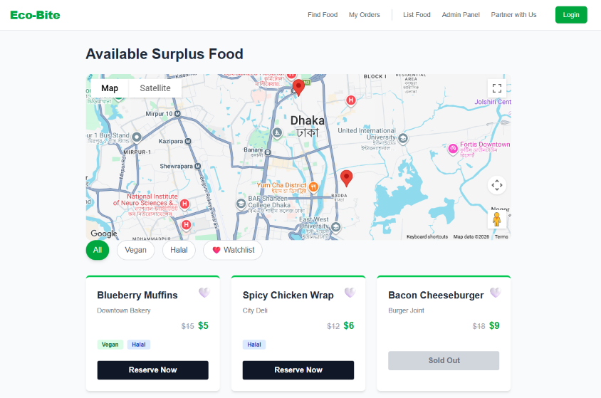
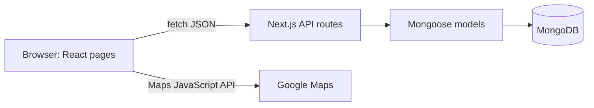
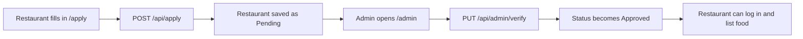
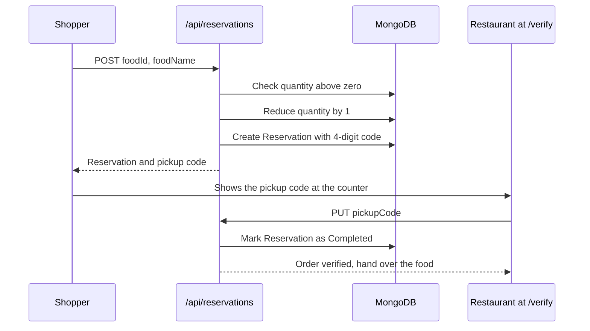

# Eco-Bite


**A surplus food rescue platform.** Restaurants list food that would otherwise be thrown away at a discount, shoppers reserve it and collect it with a pickup code, and an admin approves the partner organisations that join.

<p align="center">
  
</p>
<p align="center"><em>The shopper page (<code>/food</code>): a Google Map of available food, dietary filters, and discounted surplus items.</em></p>

## Table of contents

1. [Why Eco-Bite](#why-eco-bite)
2. [Features](#features)
3. [How the pieces fit together](#how-the-pieces-fit-together)
4. [Tech stack](#tech-stack)
5. [Project structure](#project-structure)
6. [Component reference](#component-reference)
7. [Business logic](#business-logic)
8. [Getting started](#getting-started)
9. [Deployment](#deployment)
10. [Security and known limitations](#security-and-known-limitations)
11. [Troubleshooting](#troubleshooting)
12. [Roadmap](#roadmap)
13. [Contributing](#contributing)
14. [Credits](#credits)
15. [License](#license)

## Why Eco-Bite

Restaurants, bakeries and grocers often end the day with perfectly good food they cannot sell. At the same time, many people struggle to afford meals. Eco-Bite connects the two:

- **Restaurants** recover some value from food that would be thrown away.
- **Shoppers** get meals at a lower price, and the price drops further as closing time approaches.
- **Charities** can join as verified partners.
- **Admins** keep the platform trustworthy by approving every partner before it can list food.

## Features

### Shoppers
- Browse surplus food with **Vegan** and **Halal** filters.
- Save favourites to a **watchlist** (kept in the browser's local storage).
- See available food on a **Google Map**.
- See **dynamic prices** that fall as an item approaches its expiry time.
- **Reserve** an item and receive a 4-digit **pickup code**.
- View **order history**.

### Restaurants
- **Apply** to become a partner.
- After approval, **list surplus items** with quantity, original and discounted price, dietary tags and an expiry time.
- **Verify a customer's pickup code** at handover.

### Admins
- Review restaurant and charity applications in one table and **approve or reject** them.

## How the pieces fit together

Eco-Bite is a single Next.js application. The pages (what people see) and the API routes (the backend) live in the same project and deploy together.



### The three main journeys

**1. Onboarding a restaurant**



**2. Listing food**

A logged-in restaurant opens `/add-food`, fills in the form, and the page sends `POST /api/food`. The API saves a `FoodItem` document. Shoppers then see it when `GET /api/food` returns the list, with a freshly calculated price.

**3. Reserving and collecting food**



## Tech stack

| Layer | Technology | What it is used for |
| --- | --- | --- |
| Framework | [Next.js](https://nextjs.org) 16 (App Router) | Pages, routing and backend API routes in one project |
| UI library | React 19 | Interactive components. The React Compiler is switched on in `next.config.mjs` |
| Styling | Tailwind CSS 4 | Utility classes for all layout and colours |
| Database | MongoDB with Mongoose 9 | Stores restaurants, charities, food items and reservations |
| Maps | Google Maps JavaScript API via `@react-google-maps/api` | The map on the shopper page |
| Linting | ESLint 9 with `eslint-config-next` | Code quality checks (`npm run lint`) |
| Hosting | Vercel | Build and hosting, redeploys on every push to `main` |

## Project structure

```
ECO-BITE_repo/
├── src/
│   ├── app/                          Pages and API routes (Next.js App Router)
│   │   ├── layout.js                 Root layout: fonts, Navbar, wraps every page
│   │   ├── page.js                   Home page ( / ), currently a simple placeholder
│   │   ├── globals.css               Tailwind import and light/dark colour variables
│   │   ├── favicon.ico               Browser tab icon
│   │   ├── apply/page.js             Partner application form
│   │   ├── login/page.js             Development login (role picker)
│   │   ├── admin/page.js             Approve or reject applications
│   │   ├── add-food/page.js          Restaurants list surplus food
│   │   ├── food/page.js              Shopper view: filters, watchlist, map, cards
│   │   ├── orders/page.js            Order history and review form
│   │   ├── verify/page.js            Restaurants verify a pickup code
│   │   └── api/                      Backend endpoints
│   │       ├── apply/route.js
│   │       ├── restaurants/route.js
│   │       ├── food/route.js
│   │       ├── reservations/route.js
│   │       ├── orders/route.js
│   │       └── admin/
│   │           ├── applications/route.js
│   │           └── verify/route.js
│   ├── components/
│   │   ├── Navbar.js                 Top navigation bar
│   │   └── FoodMap.js                Google Map of available food
│   ├── lib/
│   │   └── db.js                     Cached MongoDB connection
│   └── models/                       Mongoose schemas (the database blueprints)
│       ├── Restaurant.js
│       ├── Charity.js
│       ├── FoodItem.js
│       └── Reservation.js
├── public/                           Static files (leftover Next.js template icons, unused)
├── docs/screenshots/                 Images used in this README
├── .env.example                      Template listing the required environment variables
├── .gitignore                        Files git must never upload (secrets, build output)
├── eslint.config.mjs                 ESLint rules
├── jsconfig.json                     Editor path alias: @/ points to src/
├── next.config.mjs                   Next.js settings (React Compiler on)
├── postcss.config.mjs                Connects Tailwind CSS to the build
├── package.json                      Dependencies and npm scripts
├── LICENSE                           MIT license
└── README.md                         This file
```

## Component reference

This section explains what every part of the project does and how it connects to the others.

### Pages

Every page is a React component. Pages marked **client** run in the browser (`"use client"`) because they keep state or read local storage.

#### `/` Home (`src/app/page.js`)
A placeholder landing page with the Eco-Bite name and tagline. It does not call any API yet.

#### `/food` Shopper view (`src/app/food/page.js`) - client
The main page for shoppers.

- **Data:** the list of foods starts as three hard-coded sample items (Blueberry Muffins, Spicy Chicken Wrap, Bacon Cheeseburger). It does not call `GET /api/food` yet.
- **Filters:** four buttons (All, Vegan, Halal, Watchlist) change `activeFilter`. The page filters the list in the browser before drawing it.
- **Watchlist:** clicking a heart adds or removes the item's id from a list saved in local storage under the key `ecoBiteFavorites`. The list is restored when the page loads.
- **Map:** the filtered list is passed to the `FoodMap` component, so the pins match the filter.
- **Cards:** each card shows the name, restaurant, the original price crossed out, and the current price (`dynamicPrice`, or `discountedPrice` when there is none). When `isSurgeDiscounted` is true it also shows a red "Expiry Price Drop" badge with the hours left. Sold-out items (quantity 0) have a disabled grey button.
- **Not finished:** the "Reserve Now" button has no click handler yet.

#### `/add-food` List food (`src/app/add-food/page.js`) - client
A form for approved restaurants.

- On load it reads the logged-in user from local storage (key `ecoBiteUser`).
- Fields: name, quantity, original price, discounted price, Vegan and Halal checkboxes, expiry or closing time.
- On submit it sends `POST /api/food` with the form data plus `restaurantId`, `restaurantName` and `restaurantAddress` taken from the logged-in restaurant. Without a login it falls back to "Unknown Restaurant" and "Unknown Location".
- It shows a browser alert on success or failure and clears most of the form.

#### `/apply` Partner application (`src/app/apply/page.js`) - client
Lets a restaurant or charity ask to join.

- A dropdown chooses **Restaurant / Cafe / Grocery** or **Registered Charity / Food Bank**.
- The last field changes with the choice: a physical address for restaurants, a contact email for charities.
- On submit it sends `POST /api/apply`. The new application starts with status **Pending**.
- On success it replaces the form with an "Application Received" message.

#### `/login` Development login (`src/app/login/page.js`) - client
A stand-in for real authentication, used during development.

- It loads restaurants from `GET /api/restaurants` and keeps only the **Approved** ones for the dropdown.
- You pick a role: **consumer**, **restaurant** or **admin**. Restaurants also pick which restaurant they are.
- It saves your choice to local storage as `ecoBiteUser`, for example `{ role: "restaurant", id, name, address }`.
- It then redirects: admin goes to `/admin`, restaurant to `/add-food`, consumer to `/food`.

#### `/admin` Admin panel (`src/app/admin/page.js`) - client
The approval desk for partner applications.

- On load it checks local storage. If the saved role is not `admin`, it shows an alert and redirects to `/login`.
- It loads `GET /api/admin/applications` and shows a table: organisation name, type badge (Restaurant or Charity), contact or address, status badge, and actions.
- **Approve** and **Reject** buttons appear only for Pending applications. A click sends `PUT /api/admin/verify` and updates the row on screen.

#### `/orders` Order history (`src/app/orders/page.js`) - client
Lists reservations from `GET /api/orders`.

- Each row shows the food name, the pickup code, and a status badge (Pending or Completed).
- Completed orders without a rating show a "Leave Review" button, which opens a star rating and a text box.
- **Not finished:** submitting a review sends `PUT /api/orders`, which does not exist yet, so reviews are not saved.

#### `/verify` Verify pickup (`src/app/verify/page.js`) - client
Used by a restaurant at the counter.

- The restaurant types the customer's 4-digit code.
- It sends `PUT /api/reservations`. A green message shows the food name on success, and a red message shows an error for an invalid or already used code.

### Shared components (`src/components`)

#### `Navbar.js`
The top bar shown on every page (it is added once in `layout.js`). It holds the Eco-Bite logo link and links to Find Food (`/food`), My Orders (`/orders`), List Food (`/add-food`), Admin Panel (`/admin`), Partner with Us (`/apply`) and a green Login button (`/login`). It is a server component with no state.

#### `FoodMap.js`
The Google Map on `/food` (client component).

- Loads the Google Maps script with `useJsApiLoader`, using the key from `NEXT_PUBLIC_GOOGLE_MAPS_API_KEY`. While loading it shows "Loading map...".
- The map is centred on Dhaka (latitude 23.794, longitude 90.412) at zoom level 13 and is 350 pixels tall.
- It draws one pin per food item that is still in stock. Sold-out items get no pin.
- **Pin positions are placeholders.** Food items do not store coordinates yet, so the pins are spread evenly on a small circle around the map centre. Hovering a pin shows the food name.

### Root layout and styles

- `layout.js` wraps every page. It loads the Geist fonts from Google Fonts, sets the page title ("Eco-Bite") and description, and renders the `Navbar` above the page content.
- `globals.css` imports Tailwind CSS and defines light and dark colour variables that follow the visitor's system theme.

### Database connection (`src/lib/db.js`)

`dbConnect()` opens the MongoDB connection using `MONGODB_URI`. Next.js reloads code often in development and runs API routes as short-lived serverless functions, so opening a new connection per request would quickly exhaust the database. The file therefore stores the connection (and the pending connection promise) on `global.mongoose` and reuses it. Every API route calls `await dbConnect()` first. If `MONGODB_URI` is missing, the file throws an error immediately.

### Data models (`src/models`)

Each model is a Mongoose schema: a blueprint that describes what one document in a MongoDB collection looks like.

**`Restaurant`**

| Field | Type | Notes |
| --- | --- | --- |
| `name` | String | Required |
| `address` | String | Required |
| `status` | String | `Pending` (default), `Approved` or `Rejected` |
| `createdAt` | Date | Defaults to now |

**`Charity`**

| Field | Type | Notes |
| --- | --- | --- |
| `name` | String | Required |
| `contactEmail` | String | Required |
| `status` | String | `Pending` (default), `Approved` or `Rejected` |
| `createdAt` | Date | Defaults to now |

**`FoodItem`**

| Field | Type | Notes |
| --- | --- | --- |
| `name` | String | Required |
| `quantity` | Number | Required, 0 or more. Falls by 1 for every reservation |
| `originalPrice` | Number | Required, the normal price |
| `discountedPrice` | Number | Required, the listed surplus price |
| `isVegan`, `isHalal` | Boolean | Default false |
| `expiryTime` | Date | Used for dynamic pricing. Optional |
| `restaurantId` | ObjectId | Reference to the posting `Restaurant` |
| `restaurantName`, `restaurantAddress` | String | Copied from the logged-in restaurant when posting |
| `createdAt` | Date | Defaults to now |

**`Reservation`**

| Field | Type | Notes |
| --- | --- | --- |
| `foodId` | ObjectId | Required, reference to the reserved `FoodItem` |
| `foodName` | String | Required |
| `pickupCode` | String | Required, the 4-digit code |
| `status` | String | `Pending` (default), `Completed` or `Cancelled` |
| `rating` | Number | 1 to 5, set by the review feature |
| `reviewText` | String | Optional review comment |
| `createdAt` | Date | Defaults to now |

### API reference (`src/app/api`)

All endpoints return JSON. Successful responses look like `{ "message": "...", "data": ... }` and errors look like `{ "error": "..." }`.

#### `POST /api/apply`
Creates a partner application.

```json
{ "type": "restaurant", "name": "Downtown Bakery", "contactInfo": "123 Main St" }
```
`type` is `restaurant` (saved as a `Restaurant`, `contactInfo` becomes the address) or `charity` (saved as a `Charity`, `contactInfo` becomes the email). Returns `201`. An unknown type returns `400`.

#### `GET /api/restaurants`
Returns every restaurant, newest first, whatever its status. The login page filters for Approved ones.

#### `GET /api/admin/applications`
Returns restaurants and charities merged into one list, newest first. Each entry gets an `orgType` (`Restaurant` or `Charity`) and a common `contact` field (address or email) so the admin table can treat them the same.

#### `PUT /api/admin/verify`
Approves or rejects an application.

```json
{ "orgId": "<mongo id>", "orgType": "Restaurant", "action": "Approve" }
```
`action: "Approve"` sets the status to Approved. Any other value sets it to Rejected. All three fields are required, otherwise `400`.

#### `GET /api/food`
Returns every food item with price information added:

| Added field | Meaning |
| --- | --- |
| `dynamicPrice` | Current price after the expiry discount |
| `isSurgeDiscounted` | `true` when an expiry discount applies |
| `hoursLeft` | Hours until expiry, one decimal place, never below 0 |

Items that are still in stock come first and sold-out items last. See [Dynamic expiry pricing](#dynamic-expiry-pricing).

#### `POST /api/food`
Creates a food item from the JSON body (name, quantity, prices, tags, expiry time and restaurant details). Returns `201`.

#### `PUT /api/food?id=<id>` and `DELETE /api/food?id=<id>`
Update or delete one food item. The `id` query parameter is required, otherwise `400`. `PUT` takes the fields to change in the body.

#### `POST /api/reservations`
Reserves one unit of a food item.

```json
{ "foodId": "<mongo id>", "foodName": "Blueberry Muffins" }
```
It checks that the item exists and has stock (otherwise `400`, "Sorry, this item is sold out!"), reduces `quantity` by 1, generates a pickup code, creates the `Reservation` and returns it with `201`.

#### `PUT /api/reservations`
Verifies a pickup.

```json
{ "pickupCode": "4921" }
```
It finds a **Pending** reservation with that code and marks it **Completed**. If none matches, or the order was already collected, it returns `400`.

#### `GET /api/orders`
Returns all reservations, newest first.

## Business logic

### Dynamic expiry pricing
Implemented in `GET /api/food`. For every item the API works out the hours left until `expiryTime`:

| Hours left | Price shown |
| --- | --- |
| More than 2 | `discountedPrice` unchanged |
| More than 1, up to 2 | `discountedPrice` x 0.8 (20% off), rounded down |
| More than 0, up to 1 | `discountedPrice` x 0.5 (50% off), rounded down |
| 0 or expired | `discountedPrice` unchanged (the item is already past its time) |

Items saved without an `expiryTime` are treated as expiring 4 hours after `createdAt`. Prices are calculated every time the list is requested, so nothing needs to be scheduled.

### Partner approval
New restaurants and charities always start as **Pending**. Only an admin action changes them to **Approved** or **Rejected**. The login page lists only Approved restaurants, so an unapproved restaurant cannot log in as a restaurant.

### Reservations and pickup codes
Reserving reduces stock by one and creates a `Reservation` with a random 4-digit code (1000 to 9999). At the counter, the restaurant enters the code on `/verify`. Only Pending reservations can be verified, which stops the same code being used twice.

### Browser-stored state
Two values live in the visitor's browser (local storage), not in the database:

| Key | Holds | Used by |
| --- | --- | --- |
| `ecoBiteUser` | The development "session": role, and for restaurants their id, name and address | `/login`, `/admin`, `/add-food` |
| `ecoBiteFavorites` | A list of favourited food ids | `/food` |

## Getting started

### Prerequisites

- **Node.js 20.9 or newer** (includes `npm`). Download the LTS version from [nodejs.org](https://nodejs.org).
- **A MongoDB database.** A free [MongoDB Atlas](https://www.mongodb.com/atlas) cluster is enough.
- **A Google Maps JavaScript API key** for the map on `/food`. The rest of the app works without it.

### 1. Get the code

```bash
git clone https://github.com/amreenhassan13/ECO-BITE_repo.git
cd ECO-BITE_repo
npm install
```

### 2. Set up MongoDB Atlas

1. Create a free account and a free cluster at [mongodb.com/atlas](https://www.mongodb.com/atlas).
2. Under **Database Access**, add a database user with a username and password.
3. Under **Network Access**, allow your IP address. (For a Vercel deployment you will need `0.0.0.0/0`, see [Deployment](#deployment).)
4. Click **Connect**, then **Drivers**, and copy the connection string. Replace `<password>` with your password. Add a database name before the `?`, for example `...mongodb.net/ecobite?retryWrites=true...`. If your password has special characters such as `@` or `#`, URL-encode them.

### 3. Set up the Google Maps key

1. In [Google Cloud Console](https://console.cloud.google.com), create or choose a project.
2. Enable the **Maps JavaScript API**. Google may ask you to attach a billing account. Maps has a free monthly allowance that is plenty for development.
3. Go to **Credentials**, create an **API key**, and restrict it to **HTTP referrers**. Add `http://localhost:3000/*` for local work and your deployed site's address later.

### 4. Add your environment variables

Create a file named `.env.local` in the project root (copy `.env.example` and fill it in):

```
MONGODB_URI=your-mongodb-connection-string
NEXT_PUBLIC_GOOGLE_MAPS_API_KEY=your-google-maps-key
```

| Variable | Required | Purpose |
| --- | --- | --- |
| `MONGODB_URI` | Yes | MongoDB connection string. The app throws an error at start-up without it. |
| `NEXT_PUBLIC_GOOGLE_MAPS_API_KEY` | For the map | Google Maps key. The `NEXT_PUBLIC_` prefix means it is sent to the browser, which is why you must restrict it by referrer. |

`.env.local` is listed in `.gitignore`, so it is never uploaded. Never commit real keys.

### 5. Run it

```bash
npm run dev
```

Open [http://localhost:3000](http://localhost:3000). Stop the server with `Ctrl+C`. After changing `.env.local`, stop and restart the server.

| Command | Purpose |
| --- | --- |
| `npm run dev` | Start the development server with live reload |
| `npm run build` | Create an optimised production build |
| `npm run start` | Run the production build |
| `npm run lint` | Check the code with ESLint |

### 6. Try the full flow

1. Open `/apply`, choose **Restaurant**, and submit a name and address.
2. Open `/login`, choose **admin**, click Log In, and on `/admin` click **Approve** for your restaurant.
3. Open `/login` again, choose **restaurant**, pick your restaurant, and log in. You land on `/add-food`.
4. Post a food item with an expiry time a few hours ahead.
5. Check the API directly at [http://localhost:3000/api/food](http://localhost:3000/api/food) to see your item with its `dynamicPrice`.

To reserve and collect an item, call the API directly for now (the "Reserve Now" button is not wired up yet):

```bash
# Reserve one unit (replace the id with a real _id from /api/food)
curl -X POST http://localhost:3000/api/reservations \
  -H "Content-Type: application/json" \
  -d '{"foodId":"<id>","foodName":"Blueberry Muffins"}'

# Collect it with the returned pickup code
curl -X PUT http://localhost:3000/api/reservations \
  -H "Content-Type: application/json" \
  -d '{"pickupCode":"4921"}'
```

## Deployment

Eco-Bite deploys to [Vercel](https://vercel.com) with no extra configuration.

1. Push the repository to GitHub.
2. At [vercel.com/new](https://vercel.com/new), import the repository. The framework is detected as **Next.js**.
3. Under **Settings, Environment Variables**, add `MONGODB_URI` and `NEXT_PUBLIC_GOOGLE_MAPS_API_KEY`. Do this before the first build, because the build fails without `MONGODB_URI`.
4. In MongoDB Atlas, under **Network Access**, allow `0.0.0.0/0`. Vercel runs your code from changing IP addresses, so a fixed IP allow-list will not work.
5. In Google Cloud, add your deployed address (for example `https://your-project.vercel.app/*`) to the Maps key's allowed referrers.
6. Deploy. Every later push to `main` redeploys automatically. Changing an environment variable needs a manual **Redeploy** to take effect.

## Security and known limitations

Eco-Bite is a work in progress. Please read this before putting real data or a public link on it.

**Security**
- **There is no real authentication.** `/login` is a development role picker that saves your role in the browser. Anyone can choose "admin". The `/admin` page's role check only runs in the browser, and the API routes behind it (`/api/admin/*`, and the food create, update and delete routes) do not check who is calling.
- **Order data is open.** `/api/orders` returns every reservation including pickup codes, so anyone could read a code and complete someone else's pickup.
- **No input validation on food routes.** `POST` and `PUT` on `/api/food` save the request body as it is, so a caller can set any field.
- **Reservations are not atomic.** Stock is read, reduced and saved in separate steps, so two simultaneous reservations of the last item could both succeed. Pickup codes are random and are not guaranteed to be unique.
- **Secrets.** Keep `.env.local` out of git, and restrict the Google Maps key by referrer.

**Unfinished features**
- `/food` shows sample data and its "Reserve Now" button is not connected to the reservation API.
- Reviews are not saved, because `PUT /api/orders` does not exist yet.
- Map pins are approximate and not real restaurant locations.
- Charities can apply and be approved, but there is no charity bulk-claim flow.
- `/orders` shows every order, not only the current user's.
- The `@google/generative-ai` package is installed but not used.
- The icons in `public/` come from the Next.js starter template and are unused.

## Troubleshooting

| Problem | Likely cause and fix |
| --- | --- |
| `npm` is not recognized | Node.js is not installed. Install the LTS version from [nodejs.org](https://nodejs.org), then close and reopen your terminal. |
| `Please define the MONGODB_URI environment variable` | `.env.local` is missing or in the wrong folder. It must sit next to `package.json`. Restart `npm run dev` after creating it. |
| API calls fail or hang, "Failed to load..." messages | MongoDB cannot be reached. Check the connection string and password, that Atlas **Network Access** allows your IP (or `0.0.0.0/0` on Vercel), and that your cluster is running. |
| The map shows "Loading map..." forever, or a Google error | The Maps key is missing or wrong, the **Maps JavaScript API** is not enabled, billing is not set up, or the key's referrer restriction does not include the address you are using. Check the browser console (F12). |
| "Application error: a client-side exception has occurred" | Open the browser console (F12) for the real error. Pages crash when an API returns an error instead of data, for example `/orders` when the database is unreachable. Fix the database connection first. |
| `Module not found` for `models/FoodItem` | You are on an old copy of the code. Pull the latest changes, since `src/models/FoodItem.js` is required. |
| Vercel build fails | Open the build log and read the **first** red error, not the last. The usual causes are a missing `MONGODB_URI` or a file that was not pushed to GitHub. |
| Changed `.env.local` but nothing changed | Environment variables load at start-up. Stop the server with `Ctrl+C` and run `npm run dev` again. |

## Roadmap

- [ ] Real authentication and role-based access (for example Auth.js) and protected API routes
- [ ] Connect `/food` to the live API and wire up the "Reserve Now" button
- [ ] Save reviews and ratings (`PUT /api/orders`)
- [ ] Real restaurant locations with geocoding for map pins
- [ ] Per-user order history
- [ ] Charity bulk-claim flow
- [ ] Input validation and atomic stock updates
- [ ] Restaurant dashboard for managing and tracking listings
- [ ] Automated tests

## Contributing

1. Fork the repository and create a branch: `git checkout -b my-feature`.
2. Make your changes and run `npm run lint` and `npm run build`.
3. Commit with a clear message, push to your fork and open a Pull Request.

Never commit `.env.local` or any real keys.

## Credits

Built by the Eco-Bite team. See the [contributors](https://github.com/ecobite-team/ECO-BITE_repo/graphs/contributors) for who worked on it.

## License

Released under the [MIT License](LICENSE).
